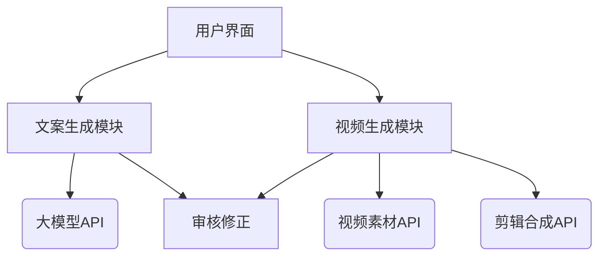
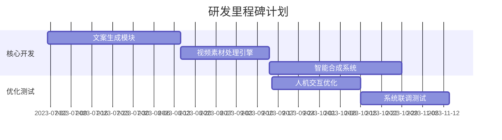
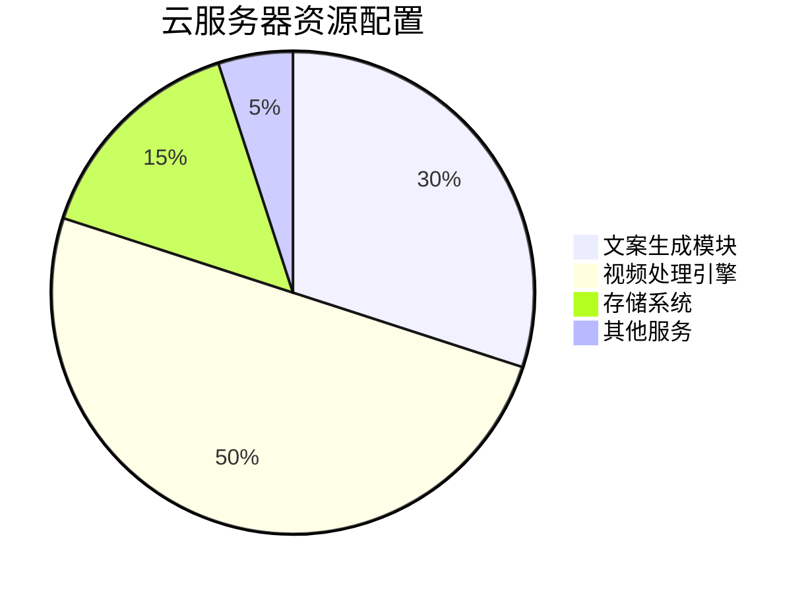

**一、精简技术架构（总周期6个月）**


**二、技术选型方案**
1. **核心开发语言**：
   - Python 3.10（全栈开发）
   - JavaScript（轻量级前端）

2. **关键技术栈**：
```markdown
| 功能模块       | 技术方案                          | 资源消耗 |
|----------------|-----------------------------------|----------|
| 文案生成       | GPT-4 API + Prompt工程           | API调用  |
| 视频素材检索   | CLIP预训练模型+ElasticSearch      | 2核4G    |
| 视频合成       | MoviePy+FFmpeg                    | CPU运算  |
| 审核系统       | 规则引擎+敏感词库                 | 1核2G    |
| 数据存储       | SQLite+MinIO对象存储              | 50GB存储 |
```

**三、里程碑计划（6个月周期）**


**四、具体实施步骤**

**第1个月：搭建基础框架**
1. 开发环境配置：
   - 云服务器：Ubuntu 22.04 + Docker
   - 开发工具：VSCode Server + Git
2. 核心模块初始化：
   ```bash
   # 项目结构
   ├── script_generator/      # 文案生成
   │   ├── prompt_engine.py   # 提示词模板
   │   └── api_wrapper.py     # 大模型接口封装
   ├── video_engine/          # 视频处理
   │   ├── clip_retriever.py  # 素材检索
   │   └── video_stitcher.py  # 视频合成
   └── app.py                 # 主界面
   ```

**第2个月：文案生成实现**
1. 使用GPT-4 API构建基础功能：
   ```python
   # prompt_engine.py
   WAR_PROMPT_TEMPLATE = """
   请生成关于{country}驻军危害的视频脚本，需包含：
   1. 至少3个真实历史事件（时间+地点+伤亡数据）
   2. 2位当地民众采访模拟语录
   3. 专家分析段落（引用权威机构数据）
   输出结构：
   [标题][导语][事件1][事件2][事件3][民众采访][专家分析][结语]
   """
   
   # api_wrapper.py
   def generate_script(prompt):
       response = openai.ChatCompletion.create(
           model="gpt-4",
           messages=[{"role": "user", "content": prompt}]
       )
       return response.choices[0].message['content']
   ```

**第3个月：视频素材处理**
1. 构建轻量级素材库：
   - 使用爬虫获取公开军事视频（限定10GB素材）
   - 建立关键帧索引：
   ```python
   # clip_retriever.py
   from sentence_transformers import SentenceTransformer
   
   model = SentenceTransformer('clip-ViT-B-32')
   def index_videos(video_dir):
       # 每10秒提取关键帧
       frame_embeddings = model.encode(frames)
       # 存储到ElasticSearch
       es.index(index='video_frames', body={
           'path': video_path,
           'embedding': frame_embeddings.tolist()
       })
   ```

**第4个月：视频合成开发**
1. 实现基础合成功能：
   ```python
   # video_stitcher.py
   from moviepy.editor import *
   
   def generate_video(script, clips):
       # 自动化字幕生成
       text_clips = [TextClip(line, fontsize=24, color='white') 
                    for line in script.split('\n')]
       # 视频拼接
       final = concatenate_videoclips([CompositeVideoClip([vc, tc]) 
                    for vc, tc in zip(clips, text_clips)])
       final.write_videofile("output.mp4")
   ```

**第5个月：人机交互优化**
1. 开发简易Web界面：
   ```javascript
   // 使用Vue3+ElementPlus构建
   <template>
     <div class="container">
       <el-steps :active="step">
         <el-step title="脚本生成"></el-step>
         <el-step title="素材匹配"></el-step>
         <el-step title="视频生成"></el-step>
       </el-steps>
       <script-editor v-show="step==0" @generate="handleGenerate"/>
     </div>
   </template>
   ```

**第6个月：系统联调测试**
1. 制定测试用例：
   ```markdown
   | 测试场景         | 验证指标                | 通过标准         |
   |------------------|-------------------------|------------------|
   | 10分钟视频生成   | 总耗时                  | <2小时           |
   | 素材匹配准确率   | 关键帧匹配成功率        | >65%             |
   | 意识形态安全     | 敏感词检测率            | 100%             |
   ```

**五、资源分配方案**


**六、关键技术取舍**
1. **不做**：
   - 自主训练大模型
   - 复杂任务分解
   - 自动化审核
2. **重点做**：
   - Prompt工程优化
   - 关键帧语义检索
   - 模板化视频合成

**七、推荐学习路径**
1. 第1周：掌握Python视频处理（MoviePy/FFmpeg）
2. 第2周：学习GPT-4 API调用
3. 第3周：搭建ElasticSearch索引
4. 第4周：开发基础Web界面